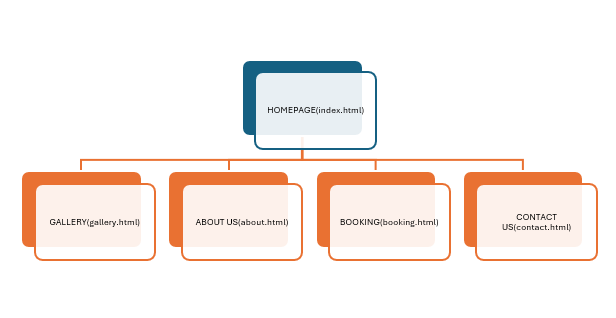

# Beru Art Tattoo Studio Website

## Student Information
- **Name:** Ligegise Tshifhiwa
- **Student Number:** ST10526941
- **Module:** WEDE5020 - Web Development (Introduction)

## Project Overview
A 5-page website for Beru Art Tattoo Studio, a Johannesburg-based creative tattoo studio.

## Pages Created
| Page | Filename | Description |
|------|----------|-------------|
| Home | index.html | Hero section, featured work |
| Gallery | gallery.html | Portfolio of tattoo work |
| About | about.html | Studio history, artists |
| Booking | booking.html | Consultation booking form |
| Contact | contact.html | Two locations, contact form |

## Sitemap

### Sitemap Explanation

The Beru Art Tattoo Studio website consists of 5 pages:

- **Home (index.html):** Entry page with hero section, call-to-action button, and featured work preview.
- **Gallery (gallery.html):** Portfolio page displaying previous tattoo work.
- **About (about.html):** Studio history, mission, vision, and artist profiles.
- **Booking (booking.html):** Consultation request form for tattoo appointments.
- **Contact (contact.html):** Two locations (Braamfontein and Melville), hours, and contact form.

All pages are linked through a navigation menu in the header.

## Changelog

### 2026-05-29 - Part 2 Submission
- Added external CSS stylesheet (style.css)
- Implemented colour scheme: black, dark grey, and gold accent
- Applied typography styles using Montserrat and Open Sans fonts
- Created responsive layout using CSS Grid and Flexbox
- Added media queries for tablet (768px) and mobile (480px) breakpoints
- Implemented hover effects on navigation links and buttons
- Styled all forms with consistent input styling

### 2026-04-20 - Part 1 Submission
- Created all 5 HTML pages
- Added navigation menu linking all pages
- Added comments to all HTML files
- Created sitemap diagram
- Created README.md

## References

### Part 1
W3Schools, 2026. *HTML Semantic Elements*. [online] Available at: https://www.w3schools.com/html/html5_semantic_elements.asp (Accessed: 20 April 2026).

The Independent Institute of Education, 2026. *Web Development (Introduction) [WEDE5020] Part 1*. (Accessed: 20 April 2026).

### Part 2
W3Schools, 2026. *CSS Tutorial*. [online] Available at: https://www.w3schools.com/css/ (Accessed: 29 May 2026).

MDN Web Docs, 2026. *CSS Grid Layout*. [online] Available at: https://developer.mozilla.org/en-US/docs/Web/CSS/CSS_Grid_Layout (Accessed: 29 May 2026).

MDN Web Docs, 2026. *CSS Flexbox*. [online] Available at: https://developer.mozilla.org/en-US/docs/Web/CSS/CSS_Flexible_Box_Layout (Accessed: 29 May 2026).

W3Schools, 2026. *CSS Media Queries*. [online] Available at: https://www.w3schools.com/css/css_rwd_mediaqueries.asp (Accessed: 29 May 2026).